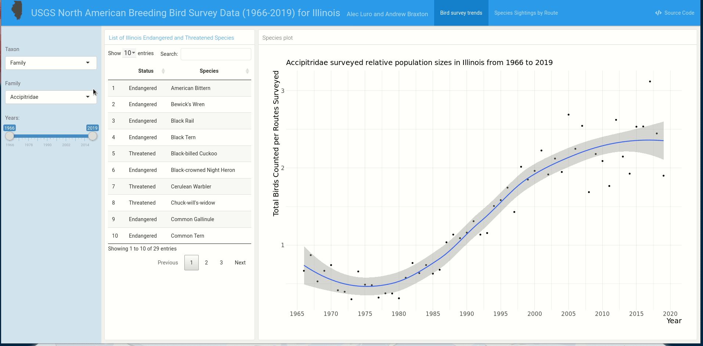
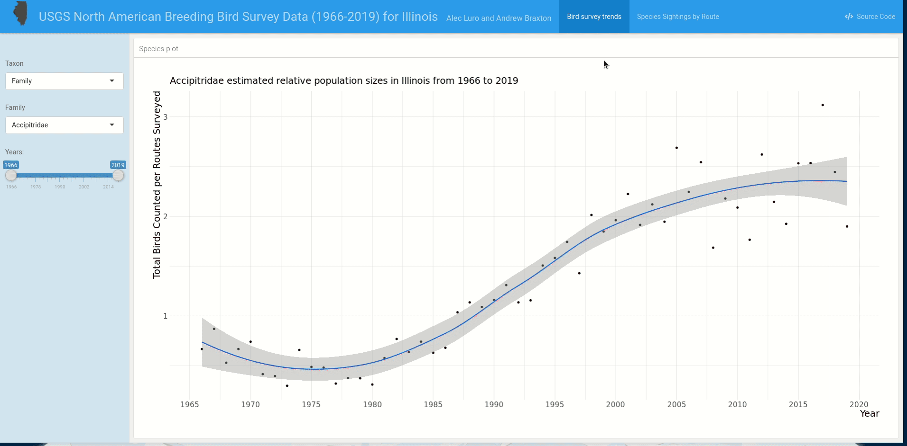

# Birds of Illinois Project

## Overview
Our project uses data from the [USGS North American Breeding Bird Survey](https://www.pwrc.usgs.gov/bbs/), a systematic survey of birds that has been ongoing since 1966, to assess long term population trends of birds found in Illinois. Graphical summaries of the survey data for the U.S. and Canada are provided by the [Patuxent Wildlife Research Center](https://www.mbr-pwrc.usgs.gov/). Here, we provide detailed graphical summaries of the bird survey population data for the state of Illinois using an [*R Shiny*](https://shiny.rstudio.com/) html dashboard using the [*flexdashboard*](https://rmarkdown.rstudio.com/flexdashboard/) R package. 

## Getting Started

1) Download the [USGS North American Breeding Bird Survey](https://www.pwrc.usgs.gov/bbs/) data
    - Run ```get_BBS_data.sh``` to create a *bbs_data* directory, then download and unzip the [data files](https://www.sciencebase.gov/catalog/item/5ea04e9a82cefae35a129d65) into the *bbs_directory*

2) Next, get the region codes associated with the countries and states that have been surveyed for birds.
    - Run ```R-scripts/00_get_bbs_region_and_species_codes.R``` to download a [.csv file](https://raw.githubusercontent.com/trashbirdecology/bbsAssistant/main/data-raw/region_codes.csv) that contains the region codes, countries, and states.

3) Concatenating the data into a single file for use in R
    - Run ```R-scripts/01_make_complete_bbs_dataset.R``` to unzip and combine separate data files for all states surveyed, combine them into a single data file, add species and region names, and export and save the full survey data as ```data/complete_bbs_data.rds```.

4) Open the interactive shiny dashboard
    - Run ```R-markdown/illinois_birds_dashboard.Rmd``` to build and run the shiny dashboard with *flexdashboard*

## Using the Dashboard

### Bird Survey Trends


This dashboard provides survey trend data for a chosen bird family or species across a range of survey years. Survey observations are weighted by the number of routes surveyed for a given year and a loess curve is shown to illustrate survey trends across years. 

+ Users can select to see the survey counts for bird families, all species surveyed, or a species for a chosen range of survey years.

### Species Sightings by Route

This dashboard page provides the number of birds sighted for a chosen species and route(s) surveyed in Illinois within the past 10-years, providing useful information about how common a given species has been for a route location.

+ Users select the "Species Sightings by Route" tab on the navigation bar, and then can choose the species and route(s) they would like to get survey counts for.

### R environment
```
> sessionInfo()
R version 4.0.3 (2020-10-10)
Platform: x86_64-pc-linux-gnu (64-bit)
Running under: Ubuntu 20.04 LTS

Matrix products: default
BLAS/LAPACK: /usr/lib/x86_64-linux-gnu/openblas-pthread/libopenblasp-r0.3.8.so

locale:
 [1] LC_CTYPE=en_US.UTF-8       LC_NUMERIC=C               LC_TIME=en_US.UTF-8        LC_COLLATE=en_US.UTF-8    
 [5] LC_MONETARY=en_US.UTF-8    LC_MESSAGES=C              LC_PAPER=en_US.UTF-8       LC_NAME=C                 
 [9] LC_ADDRESS=C               LC_TELEPHONE=C             LC_MEASUREMENT=en_US.UTF-8 LC_IDENTIFICATION=C       

attached base packages:
[1] stats     graphics  grDevices utils     datasets  methods   base     

other attached packages:
 [1] tidyr_1.1.2         hrbrthemes_0.8.0    ggplot2_3.3.2       stringr_1.4.0       magrittr_1.5       
 [6] dtplyr_1.0.1        shiny_1.5.0         flexdashboard_0.5.2 dplyr_1.0.2         data.table_1.13.2  
[11] zip_2.1.1          

loaded via a namespace (and not attached):
 [1] Rcpp_1.0.5        later_1.1.0.1     pillar_1.4.6      compiler_4.0.3    tools_4.0.3       extrafont_0.17   
 [7] digest_0.6.26     jsonlite_1.7.1    evaluate_0.14     lifecycle_0.2.0   tibble_3.0.4      gtable_0.3.0     
[13] pkgconfig_2.0.3   rlang_0.4.8       rstudioapi_0.11   yaml_2.2.1        xfun_0.18         fastmap_1.0.1    
[19] Rttf2pt1_1.3.8    withr_2.3.0       knitr_1.30        generics_0.0.2    gdtools_0.2.2     vctrs_0.3.4      
[25] systemfonts_0.3.2 grid_4.0.3        tidyselect_1.1.0  glue_1.4.2        R6_2.4.1          rmarkdown_2.5    
[31] purrr_0.3.4       extrafontdb_1.0   promises_1.1.1    scales_1.1.1      ellipsis_0.3.1    htmltools_0.5.0  
[37] xtable_1.8-4      mime_0.9          colorspace_1.4-1  httpuv_1.5.4      tinytex_0.26      stringi_1.5.3    
[43] munsell_0.5.0     crayon_1.3.4   
```
